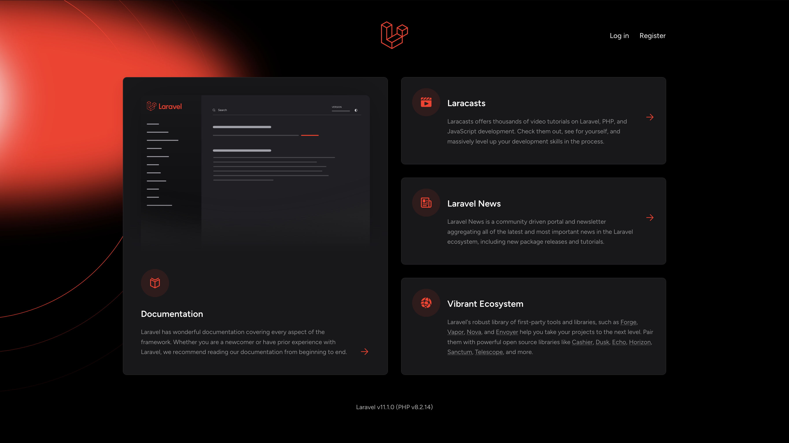
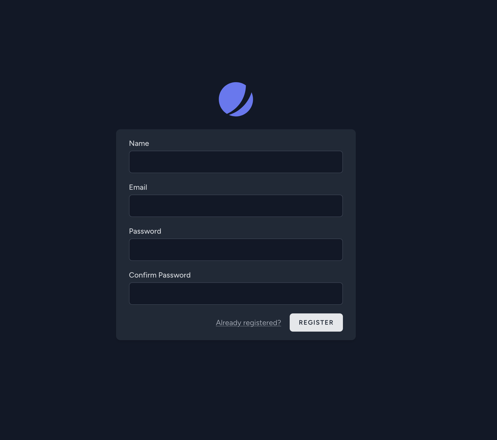
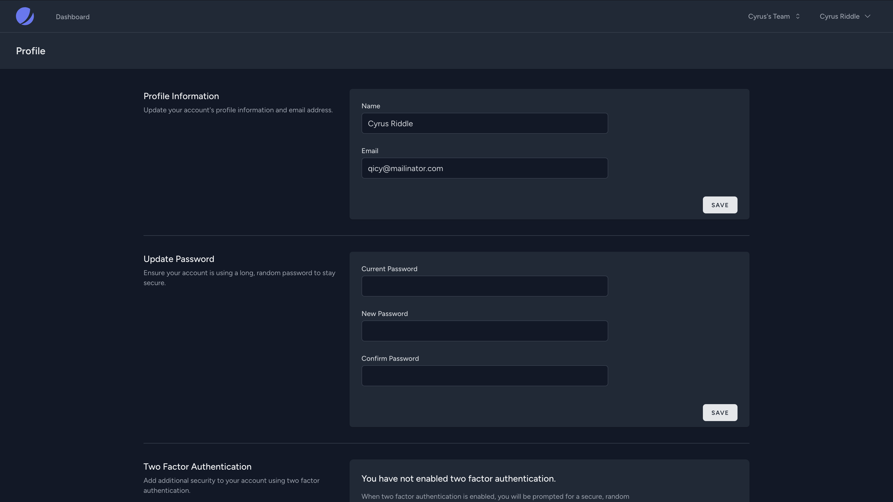
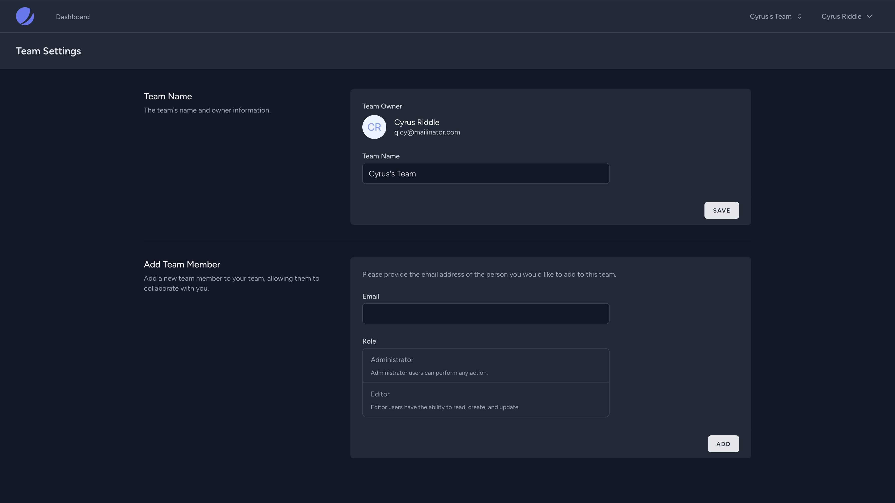

# Laravel Chat Application

### 1. Home Chat


### 2. Home Chat Mobile


### 3. Chat Desktop


### 4. Chat Desktop


### 5. Chat Desktop



## Introduction
The Laravel Reverb Jetstream


### Steps

1. **Clone the repository**
   ```bash
   git clone https://github.com/username/repository.git
   cd repository

2. **Install Dependencies**
    ```bash
    composer install

3. ** Install Node Dependencies**
    ```bash
    npm install
    npm run build 
   ---OR--- 
   npm run dev for local
